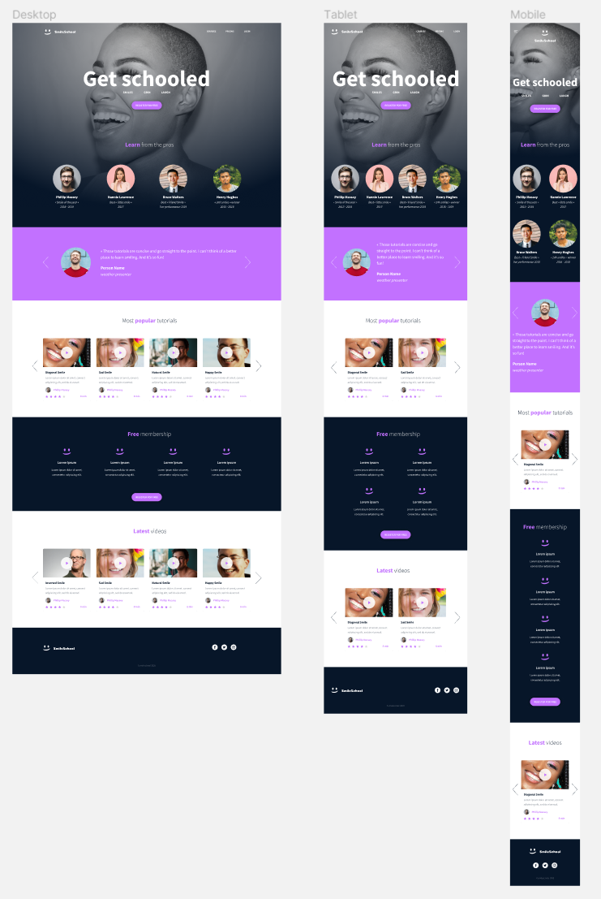

# 0x0F. Build a web app in JavaScript

### This project is the implementation of a web application and continuation of the 

The Holberton Smiling School web pages were developed by sections using the Bootstrap Front-End framework and CSS styles.

Intended to work on mobile, tablet and desktop.

